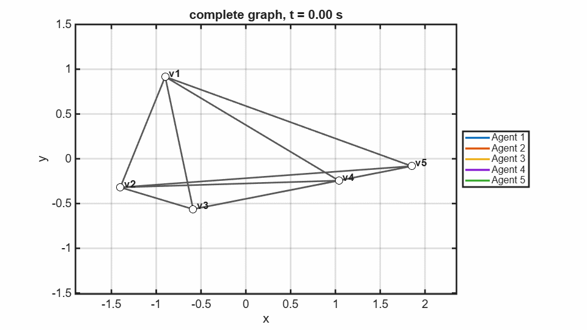
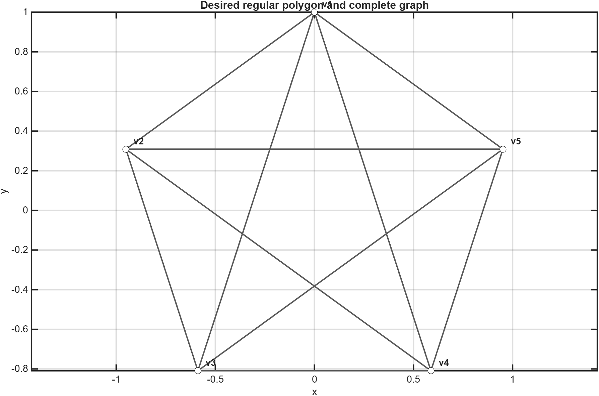
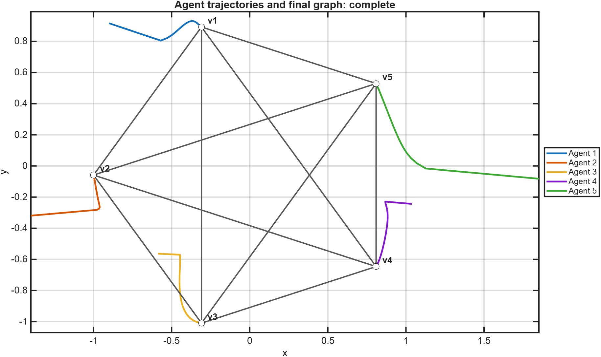
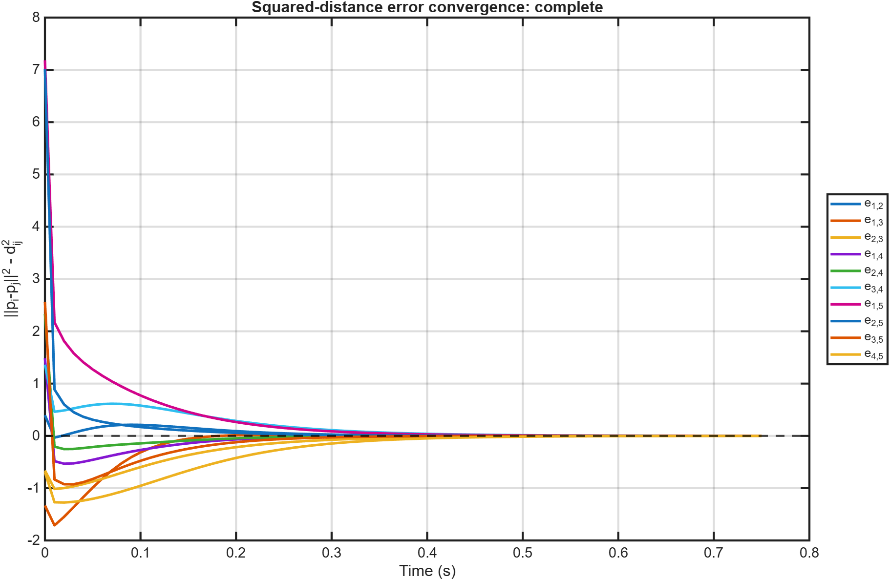

# Complete Graph Result

[Back to 2D graphs](../../README.md) | [Controller theory](../../../README.md) | [Back to project](../../../../../README.md)

The complete graph constrains every pair of agents. With the default five-agent formation, it uses 10 edges. All measured squared-distance errors converge below `0.001`; the exported transient ends at approximately 0.75 seconds.

## Animation

[Open or download the MP4 animation](animation.mp4)

The colored trails identify each agent, while the moving graph shows every active distance constraint. The legend maps each trail color to its agent number.

## Desired Shape and Graph

The desired regular pentagon is shown with all pairwise graph edges and annotated vertices.

## Trajectories and Converged Formation

Each colored curve is an agent trajectory. The overlaid graph and labels show the final converged configuration.

## Edge-Error Convergence

Each curve is $e_{ij}=\lVert p_i-p_j\rVert^2-d_{ij}^2$ for one of the 10 measured edges. All curves converge to zero.