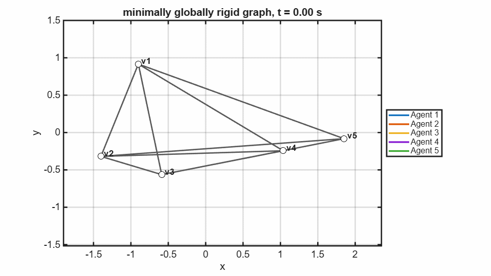
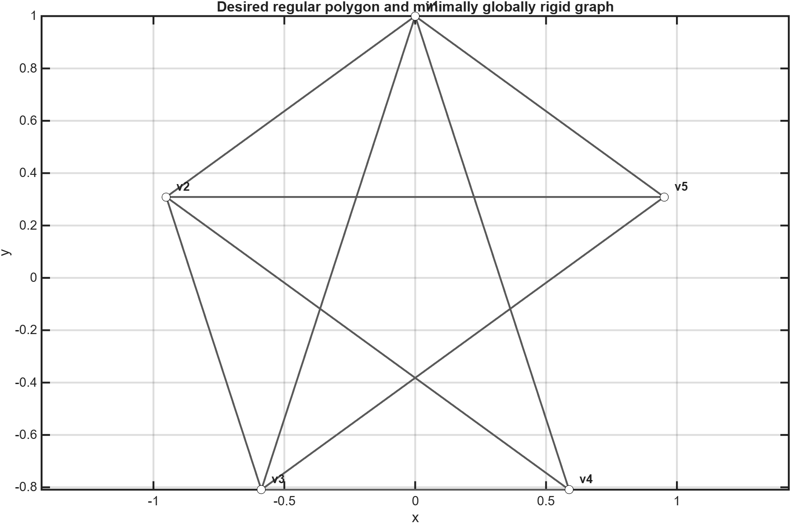
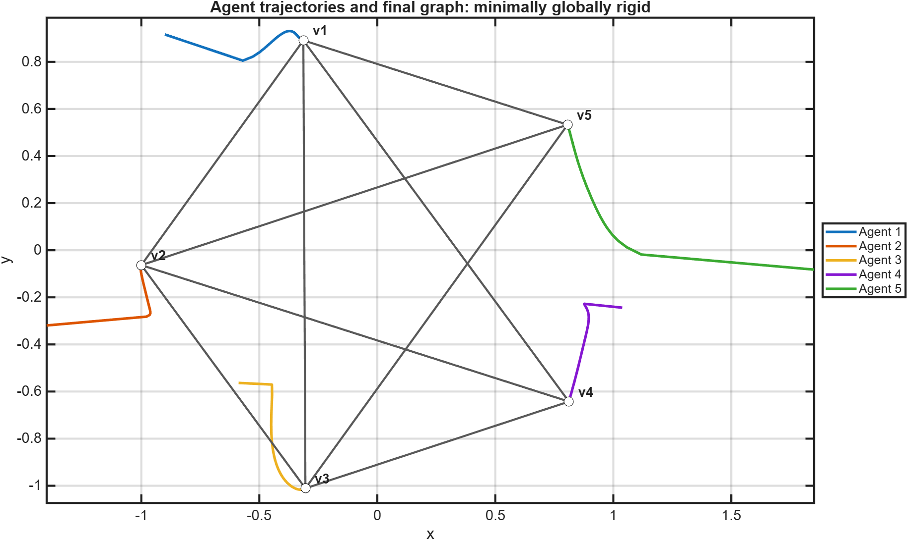
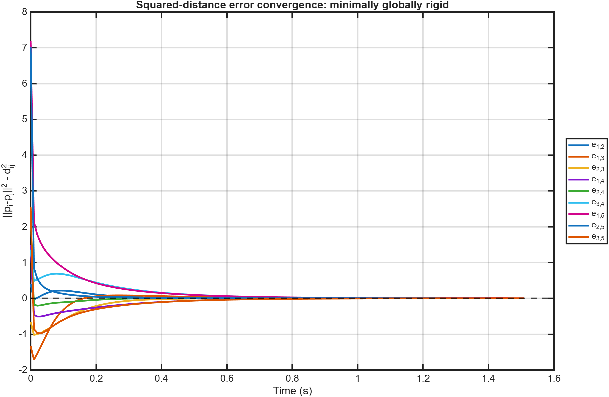

# Minimally Globally Rigid Graph Result

[Back to 2D graphs](../../README.md) | [Controller theory](../../../README.md) | [Back to project](../../../../../README.md)

This graph uses $3n-6$ constraints, giving 9 edges for the default five-agent formation. The measured squared-distance errors converge below `0.001`; the exported transient ends at approximately 1.51 seconds.

## Animation

[Open or download the MP4 animation](animation.mp4)

The animation shows colored agent trails, active graph edges, vertex annotations, and the agent legend throughout convergence.

## Desired Shape and Graph

The graph removes one complete-graph edge while retaining the requested $3n-6$ constraint count.

## Trajectories and Converged Formation

The agents converge to a configuration satisfying the nine prescribed edge distances.

## Edge-Error Convergence

All nine measured signed squared-distance errors converge to zero.