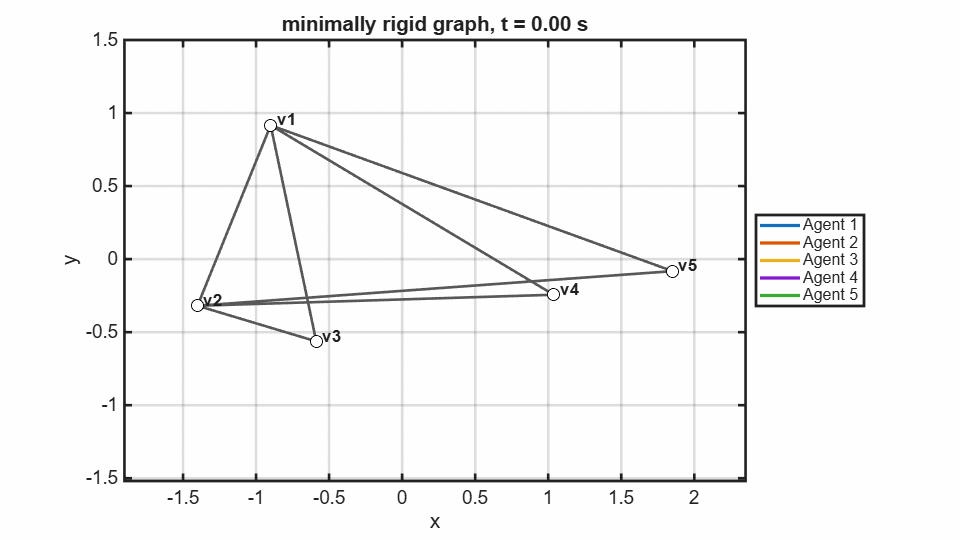
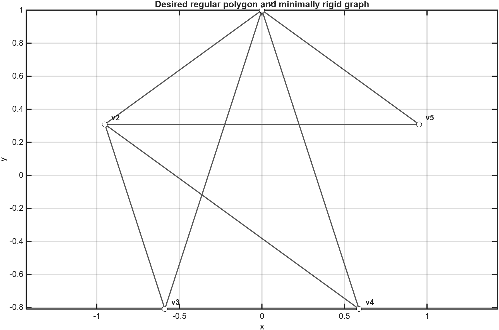
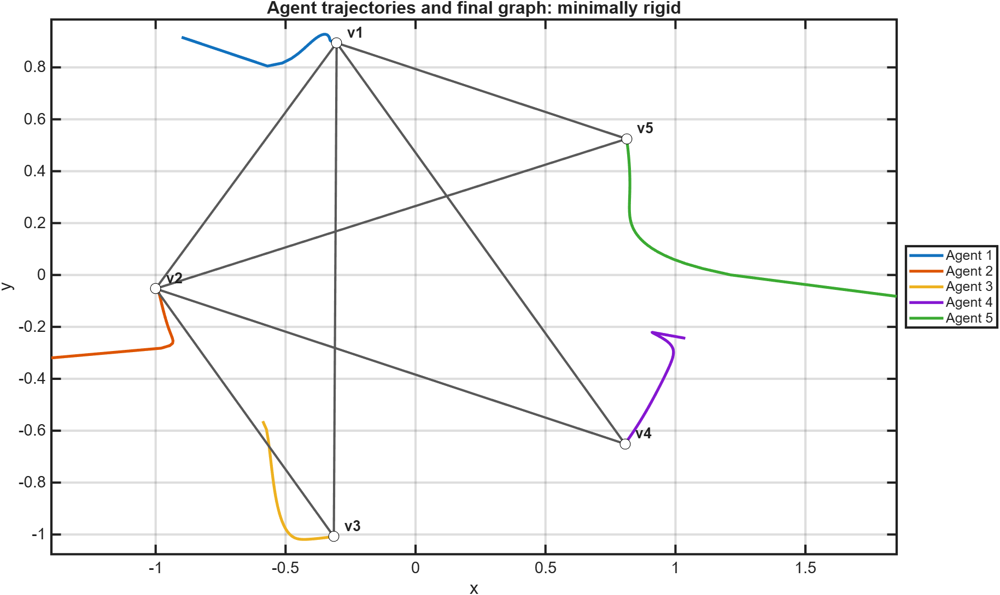
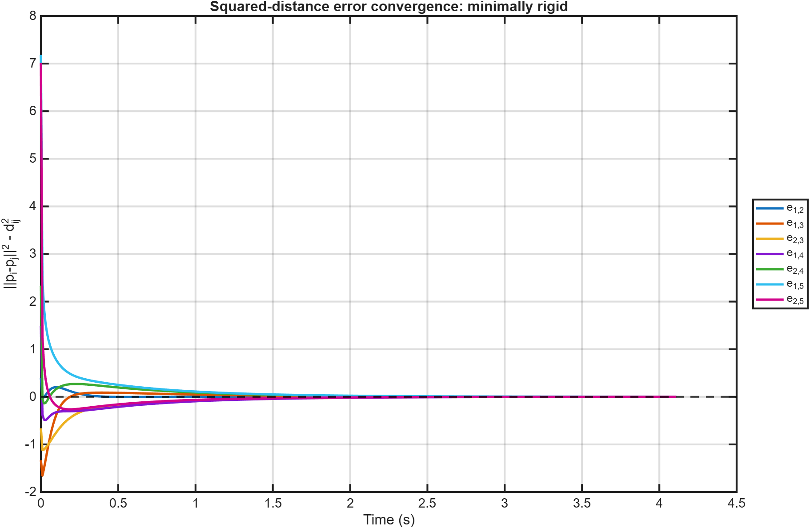

# Minimally Rigid Graph Result

[Back to 2D graphs](../../README.md) | [Controller theory](../../../README.md) | [Back to project](../../../../../README.md)

This graph uses $2n-3$ constraints, giving 7 edges for the default five-agent formation. The measured squared-distance errors converge below `0.001`; the exported transient ends at approximately 4.11 seconds.

## Animation

[Open or download the MP4 animation](animation.mp4)

The longer transient reflects the reduced set of available distance constraints. Trails and labels make each agent's motion visible.

## Desired Shape and Graph

Seven graph edges define the measured desired distances for the default case.

## Trajectories and Converged Formation

The final graph is drawn over the converged positions to show which pairwise distances were controlled.

## Edge-Error Convergence

All seven measured signed squared-distance errors converge to zero.