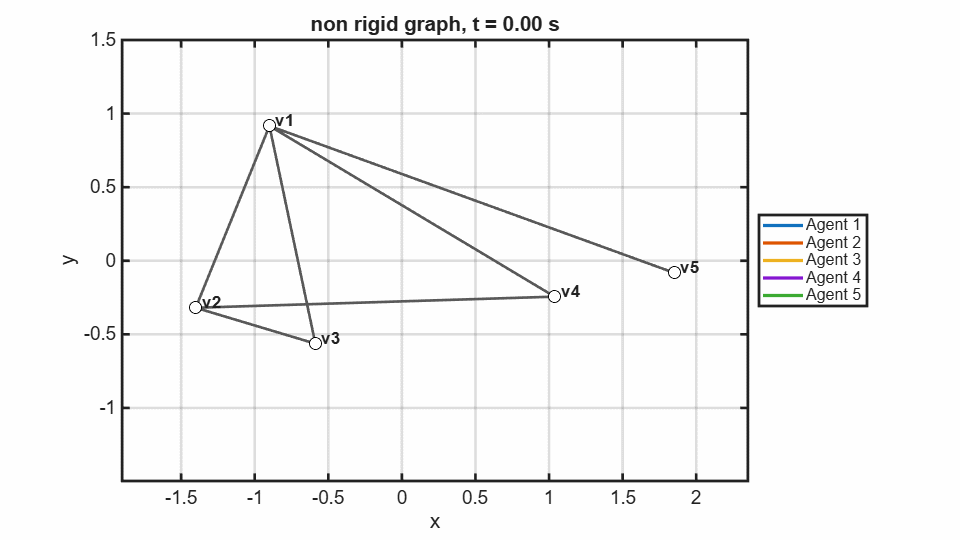
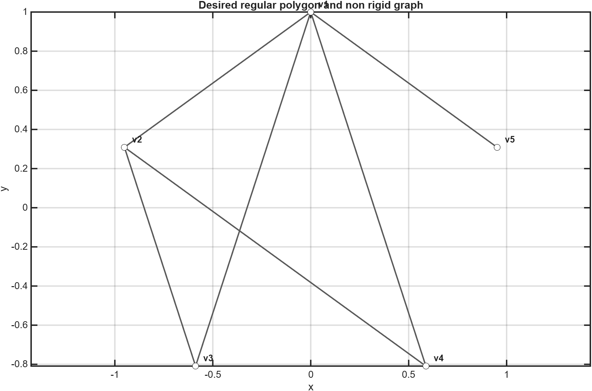
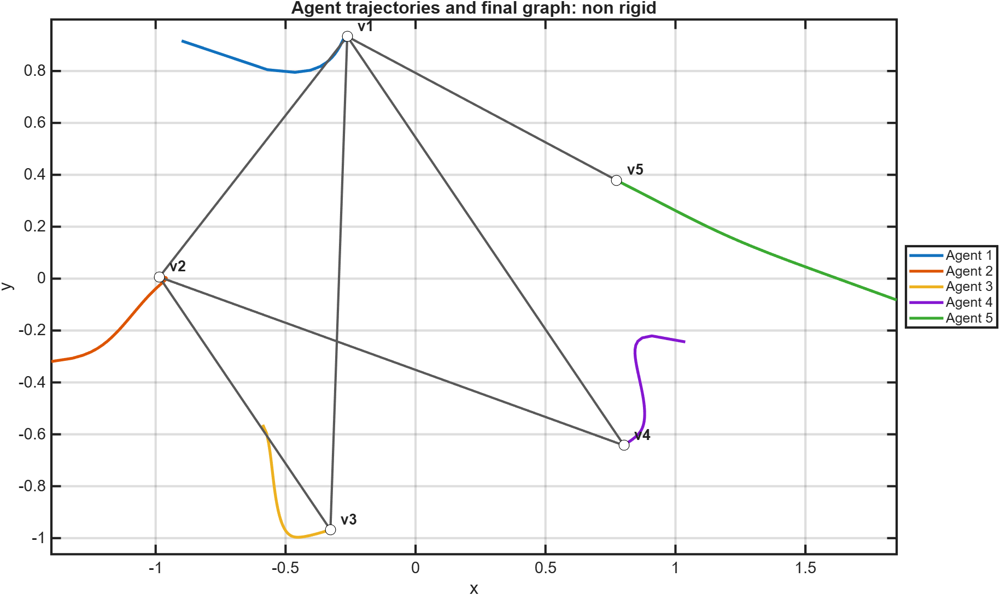
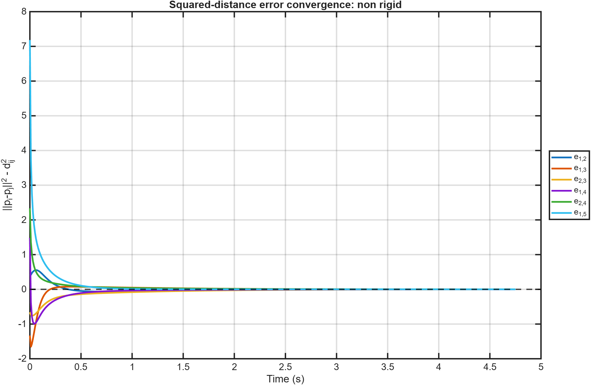

# Non-Rigid Graph Result

[Back to 2D graphs](../../README.md) | [Controller theory](../../../README.md) | [Back to project](../../../../../README.md)

This comparison uses one fewer constraint than the minimally rigid case: $2n-4$, or 6 edges for five agents. The measured squared-distance errors converge below `0.001`; the exported transient ends at approximately 4.75 seconds.

## Animation

[Open or download the MP4 animation](animation.mp4)

The colored trails show how the agents satisfy the available constraints. Because the graph is non-rigid, matching those measured distances does not uniquely determine all unmeasured pairwise distances.

## Desired Shape and Graph

The desired graph contains only six measured edges.

## Trajectories and Converged Formation

The final graph satisfies its controlled edges, but the unconstrained geometry can differ from the complete desired polygon.

## Edge-Error Convergence

All six measured signed squared-distance errors converge to zero; this does not certify the unmeasured distances.